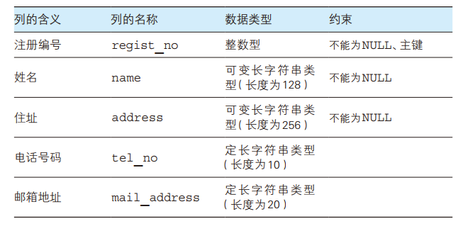

# SQL

## 第一章 初认数据库

#### 1.创建数据库

```mysql
CREATE DATABASE < 数据库名称 > ;
```

#### 2.创建表

```mysql
CREATE TABLE < 表名 >
( < 列名 1> < 数据类型 > < 该列所需约束 > ,
  < 列名 2> < 数据类型 > < 该列所需约束 > ,
  < 列名 3> < 数据类型 > < 该列所需约束 > ,
  < 列名 4> < 数据类型 > < 该列所需约束 > ,
  .
  .
  .
  < 该表的约束 1> , < 该表的约束 2> ,……);
```

##### 数据类型

- INTEGER 型

用来指定存储整数的列的数据类型（数字型），不能存储小数。

- CHAR 型

用来存储定长字符串，当列中存储的字符串长度达不到最大长度的时候，使用半角空格进行补足，由于会浪费存储空间，所以一般不使用。

- VARCHAR 型

用来存储可变长度字符串，定长字符串在字符数未达到最大长度时会用半角空格补足，但可变长字符串不同，即使字符数未达到最大长度，也不会用半角空格补足。

- DATE 型

用来指定存储日期（年月日）的列的数据类型（日期型）。

##### 约束

`NOT NULL`是非空约束，即该列必须输入数据。

`PRIMARY KEY`是主键约束，代表该列是唯一值，可以通过该列取出特定的行的数据。

#### 3.表的删除和更新

删除表

```mysql
DROP TABLE <表名>;
```

添加列

```mysql
ALTER TABLE < 表名 > ADD COLUMN < 列的定义 >;
```

删除列

```mysql
ALTER TABLE < 表名 > DROP COLUMN < 列的定义 >;
```

删除表中特定的行（语法）

```mysql
-- 一定注意添加 WHERE 条件，否则将会删除所有的数据
DELETE FROM product WHERE COLUMN_NAME='XXX';
```

清空

```mysql
TRUNCATE TABLE TABLE_NAME;
```

数据的更新

```mysql
UPDATE <表名>
   SET <列名> = <表达式> [, <列名2>=<表达式2>...]  
 WHERE <条件>  -- 可选，非常重要
 ORDER BY 子句  --可选
 LIMIT 子句; --可选
```

#### 4.插入数据

```mysql
INSERT INTO <表名> (列1, 列2, 列3, ……) VALUES (值1, 值2, 值3, ……);  
```

#### 5.索引

```mysql
CREATE TABLE mytable(  
ID INT NOT NULL,   
username VARCHAR(16) NOT NULL,  
INDEX [indexName] (username(length))  
);  
```

```mysql
-- 方法1
CREATE INDEX indexName ON table_name (column_name)

-- 方法2
ALTER table tableName ADD INDEX indexName(columnName)
```

+++

### 练习题

#### 1.1

编写一条 CREATE TABLE 语句，用来创建一个包含表 1-A 中所列各项的表 Addressbook （地址簿），并为 regist_no （注册编号）列设置主键约束



```mysql
CREATE TABLE Addressbook
(regist_no INTEGER NOT NULL,
name VARCHAR(128) NOT NULL,
adress VARCHAR(256) NOT NULL,
tel_no CHAR(10),
mail_adress CHAR(20),
PRIMARY KEY (regist_no));
```

结果如下：


#### 1.2

假设在创建练习1.1中的 Addressbook 表时忘记添加如下一列 postal_code （邮政编码）了，请编写 SQL 把此列添加到 Addressbook 表中。

列名 ： postal_code

数据类型 ：定长字符串类型（长度为 8）

约束 ：不能为 NULL

```mysql
ALTER TABLE Addressbook ADD COLUMN postal_code CHAR(8) NOT NULL;
```

#### 1.3

请补充如下 SQL 语句来删除 Addressbook 表

```sql
(DROP) table Addressbook;
```

#### 1.4

是否可以编写 SQL 语句来恢复删除掉的 Addressbook 表？

> 答：不可以。删除了的表是无法恢复的。在执行 DROP TABLE 语句之前务必仔细确认。
